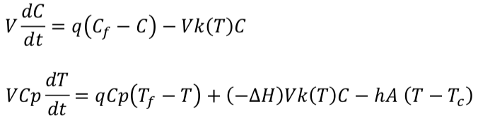
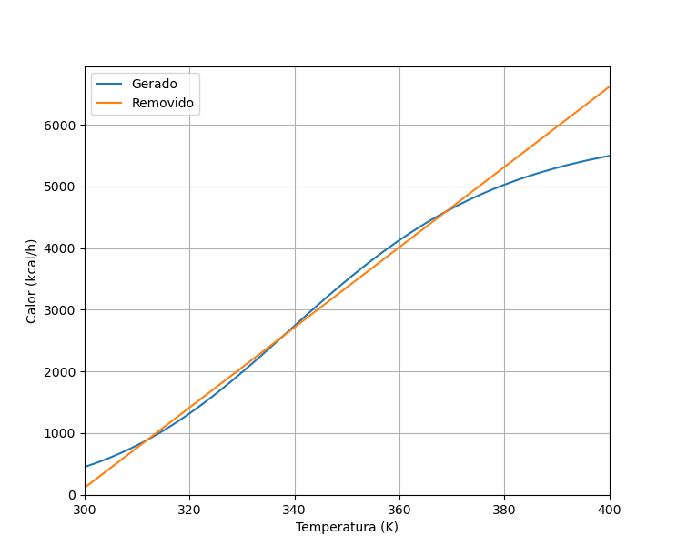
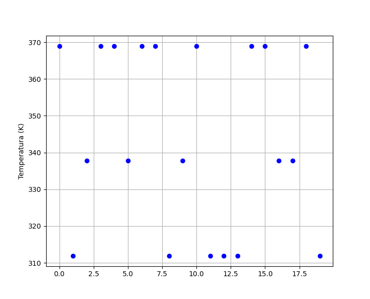
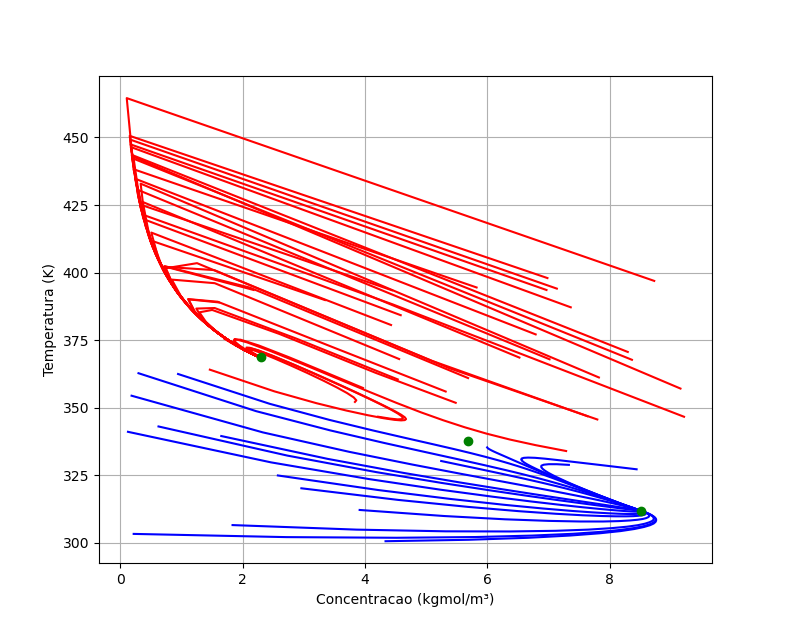
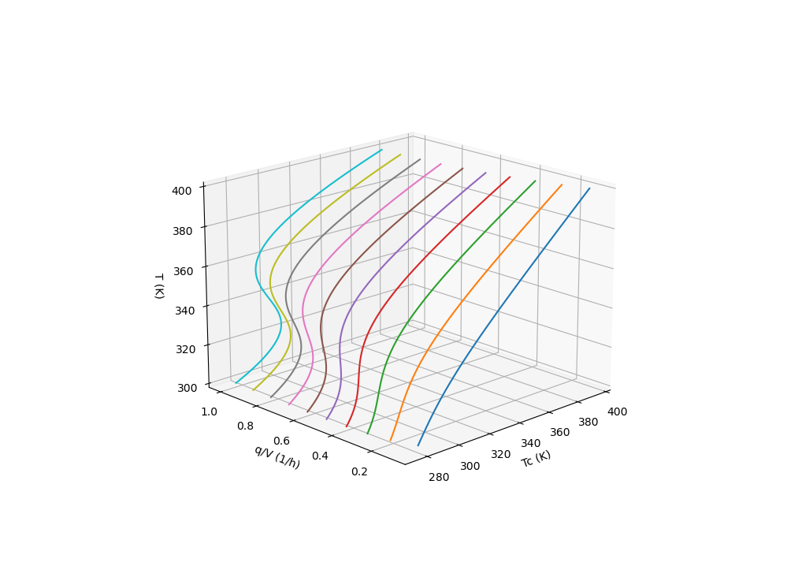
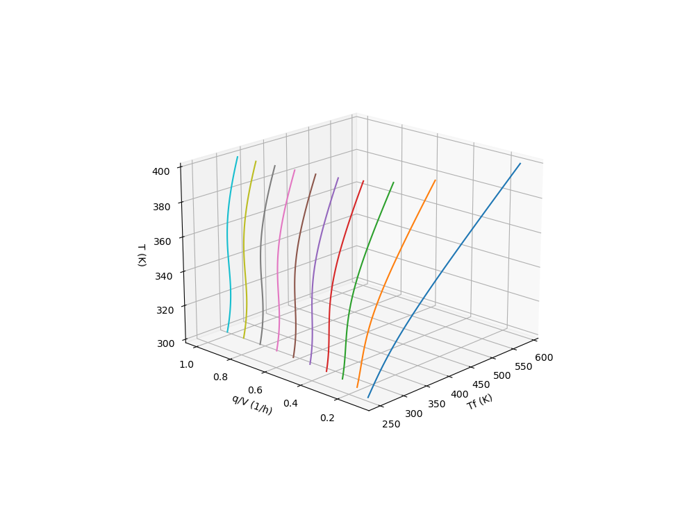

# Primeira Lista de Exercícios de Modelagem e Simulação de Processos COQ791 PEQ/COPPE/UFRJ 2020
Diego Telles

Esta Lista se baseia no Modelo do reator CSTR desenvolvido em aula, cuja estrutura final se apresenta na seguinte forma:



## Questão 1 a

Objetivo: Calcular as curvas do Calor Gerado (Qg) e Removido (Qr) em função da Temperatura de forma a observar os estados estacionários do sistma quando Qg = Qr.



O sistema se encontra no estado estacionário (dC/dt = dT/dt = 0) e portanto a partir do balanço de massa é possível calcular a Concentração do Estado estacionário para uma dada temperatura. A partir do balanço de energia, também no estado estacionário, é possível calcular o calor gerado e removido do sistema. Como se pode observar acima, as curvas de Calor Removido e Calor Gerado calculado para um conjunto Temperaturas e Concentrações se tocam em três pontos o que indica três possíveis estados estacionários do sistema.


## Questão 1 b

Objetivo: Encontrar as raízes do sistema de equações no Estado Estacionário para dirversos chutes iniciais de Concentração e Temperatura de modo a observar que o sistema possui 3 possíveis Estados Estacionário e quais estes valores de Temperatura e Concentração.



Como se pode observar, para diversos chutes aleatórios de Tempeatura e Concentração o algorítimo de resolução do sistema no estado estacionário sempre encontra um dos três pontos. São eles:

|  T(K)  | C(kgmol/m³) |
|--------|------------:|
|  312   |     8,5     |
|  338   |     5,7     |
|  369   |     2,3     |


## Questão 1 c

Objetivo: Resolver o sistema de forma dinâmica para valores aleatórios de Concentração e Tempertauras e inciais e apresentar um plano de fases que indique o caminho do sistema até atingir o Estado Estacionário.



Como se pode observar parece haver uma fronteira ao qual valores abaixo dela o sistema sempre converge para o estado estacionário de menor temperatura (curvas azuis) e acima dela o sistema sempre converge para o estado estacionário de maior temperatura (curvas vermelhas). O estado estacionário de temperatura intermediária não é estável e nenhuma curva converge para este ponto.


## Questão 1 d

Objetivo: construir 2 o diagramas de soluções estacionárias do reator. O primeiro tendo como parâmetro a Temperatura de entrada da camisa (Tc) e o segundo a Temperatura de entrada da carga para vários valores de q/v.

 

Como se pode observar a medida que os valores de q/v aumentam a curva adquire maior "sinuosidade" o indica uma presença de mais de 1 estado estacionário do sistema.


## Rodando os Algorítmos

Sugiro que um ambiente conda seja criado com os pacotes **numpy**, **scipy** e **matplotlib**. Se você não está acostumado a lidar com ambientes conda basta baixar e instalar o **[miniconda](https://docs.conda.io/en/latest/miniconda.html)**, abrir o terminal (sugiro usar o vscode) e efetuar os seguintes passos:

1 - Criar o ambiente conda com os pre-requisistos instalados
```
conda create --name COQ791 scipy matplotlib
```

2 - Ativar o ambiente conda criados
```
conda activate COQ791
```

3 - Clonar este repositório
```
git clone git@github.com:diegozd/COQ791_Lista1.git
``` 

4 - Acessar o a pasta do repositório
```
cd COQ791_Lista1
```

5 - Executar o arquivo desejado
```
python "nome do arquivo .py desejado"
```